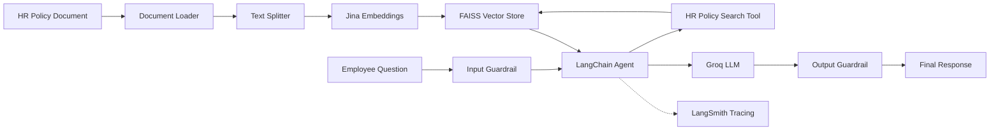

# HR Policy Assistant (RAG)
**Built with:** Python • LangChain • Groq • Jina • FAISS • Streamlit • LangSmith

An intelligent **Retrieval-Augmented Generation (RAG)** chatbot that answers employee questions using a company's HR policy document as its knowledge source.

The system combines **LangChain, Groq-hosted LLMs, Jina embeddings, FAISS vector search, safety guardrails, and LangSmith tracing** to provide grounded and safer HR policy responses.

---

## ✨ Features

* 📄 **HR Policy Document Ingestion** — Loads and processes the company's HR policy document.
* ✂️ **Document Chunking** — Splits policy content into optimized chunks for retrieval.
* 🔎 **Semantic Search** — Retrieves the most relevant policy sections using FAISS.
* 🤖 **RAG-based Answers** — Generates responses grounded in retrieved HR policy context.
* 🛡️ **Input & Output Guardrails** — Detects prompt injection, sensitive-data requests, PII leaks, unauthorized promises, and suspicious links.
* ⚡ **Groq LLM Inference** — Uses Groq-hosted models for fast responses.
* 📊 **LangSmith Tracing** — Enables monitoring and debugging of LLM workflows.
* 💾 **Reusable Vector Store** — Avoids unnecessary re-embedding on subsequent runs.
* 💬 **Streamlit Chat Interface** — Provides an interactive web-based assistant.

---


---

### RAG Pipeline

1. **Ingest** — `document_loader.py` loads `data/hr_policy.txt`.
2. **Split** — `splitter.py` divides the document into chunks using a chunk size of `500` and overlap of `60`.
3. **Embed & Store** — `embeddings.py` generates Jina embeddings and `vector_store.py` stores them in FAISS.
4. **Retrieve** — `tools.py` exposes the FAISS retriever as the `search_hr_policy` tool with top-k retrieval of `3`.
5. **Generate** — `agent.py` builds a LangChain agent using `openai/gpt-oss-20b` through Groq.
6. **Protect** — `guardrails.py` checks both user input and generated output using `openai/gpt-oss-safeguard-20b`.
7. **Trace** — LangSmith tracing can be used to monitor and debug the complete workflow.


## 🧠 How It Works



---

## 🛠️ Technology Stack

| Category                   | Technology                           |
| -------------------------- | ------------------------------------ |
| Language                   | Python                               |
| LLM Framework              | LangChain                            |
| LLM Provider               | Groq                                 |
| Generation Model           | `openai/gpt-oss-20b`                 |
| Safety Model               | `openai/gpt-oss-safeguard-20b`       |
| Embeddings                 | Jina `jina-embeddings-v2-base-en`    |
| Vector Store               | FAISS                                |
| Interface                  | Streamlit                            |
| Validation / Configuration | Python environment variables         |
| Observability              | LangSmith                            |
| Architecture               | Retrieval-Augmented Generation (RAG) |

---

## 📁 Project Structure

```text
HR-Policy-Assistant/
│
├── hr_assistant/
│   ├── config.py             # Settings, environment variables & system prompt
│   ├── document_loader.py    # Loads the HR policy document
│   ├── splitter.py           # Splits documents into chunks
│   ├── embeddings.py         # Jina embedding model
│   ├── vector_store.py       # FAISS vector store & retriever
│   ├── tools.py              # HR policy search tool
│   ├── llm.py                # Groq LLM configuration
│   ├── agent.py              # LangChain agent construction
│   ├── guardrails.py         # Input/output safety checks
│   ├── pipeline.py           # Main assistant pipeline
│   ├── logger.py             # File logging
│   └── tracing.py            # LangSmith tracing
│
├── data/
│   └── hr_policy.txt         # Source HR policy document
│
├── docs/
│   └── ...                   # Project notes & documentation
│
├── logs/                     # Runtime logs
│
├── app.py                    # Streamlit application
├── main.py                   # CLI demonstration
├── requirements.txt          # Python dependencies
├── .env                      # API keys & environment variables
├── .gitignore
└── README.md
```

---

## ⚙️ Setup & Installation


### 1. Create a Virtual Environment

```bash
python -m venv venv
```

### 2. Activate the Virtual Environment

**Windows — Command Prompt**

```bash
venv\Scripts\activate
```

**Windows — PowerShell**

```powershell
venv\Scripts\Activate.ps1
```

**Linux / macOS**

```bash
source venv/bin/activate
```

After activation, your terminal should show something similar to:

```text
(venv)
```

### 3. Install Dependencies

```bash
pip install -r requirements.txt
```

### 4. Configure Environment Variables

Create a `.env` file in the project root:

```env
GROQ_API_KEY=your_groq_api_key
JINA_API_KEY=your_jina_api_key
```

If LangSmith tracing is enabled in your configuration, add the required LangSmith variables as well.


---

## 🚀 Running the Assistant

### Streamlit Web Application

Start the interactive assistant with:

```bash
streamlit run app.py
```


## 🛡️ Safety & Guardrails

The assistant includes dedicated safety checks before and after LLM generation.

### Input Guardrails

The system can identify potentially unsafe requests such as:

* Prompt injection attempts
* Attempts to bypass system instructions
* Requests for another employee's sensitive information
* Attempts to manipulate the assistant into making unauthorized decisions

### Output Guardrails

Generated responses are checked for:

* Personally identifiable information (PII)
* Unauthorized promises or commitments
* Sensitive information leakage
* Suspicious or unsafe links

This provides an additional safety layer around the RAG and LLM pipeline.

---


---


---

## 🔄 Entry Points

| Command                | Purpose                                |
| ---------------------- | -------------------------------------- |
| `streamlit run app.py` | Launch the interactive web application |
| `python main.py`       | Run the CLI demonstration              |

---

## 📌 Key Configuration

The current RAG configuration includes:

```text
Chunk Size      : 500
Chunk Overlap   : 60
Retriever Top-K : 3
Embedding Model : jina-embeddings-v2-base-en
Vector Store    : FAISS
LLM             : openai/gpt-oss-120b
Safety Model    : openai/gpt-oss-safeguard-20b
```

## Author

Arjun Goel

MCA - VIT Vellore

Email: arjun11goel@gmail.com

Linkedin: www.linkedin.com/in/arjun11goel
