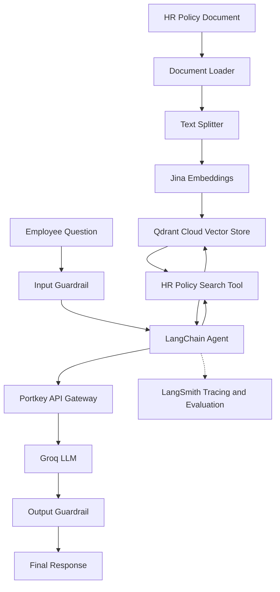

# HR Policy Assistant (RAG)

**Built with:** Python • LangChain • Groq • Portkey • Jina • Qdrant Cloud • Streamlit • LangSmith • Docker

An enterprise-grade **Retrieval-Augmented Generation (RAG)** assistant that answers employee questions using a company's HR policy document as its knowledge source.

The system combines LangChain, Groq-hosted LLMs, Jina embeddings, Qdrant Cloud vector search, Portkey API routing, safety guardrails, and LangSmith evaluation to deliver grounded HR policy responses with observability, safety checks, and automated evaluation.

[](https://hr-policy-rag-assistant-6zao.onrender.com/)

Try the HR Policy Assistant to explore policy retrieval and AI-generated responses.

---

## ✨ Features

- 📄 **HR Policy Document Ingestion** — Loads and processes the company's HR policy document.
- ✂️ **Document Chunking** — Splits policy content into manageable chunks for semantic retrieval.
- 🔎 **Semantic Search** — Retrieves relevant policy sections using Qdrant Cloud vector search.
- 🤖 **RAG-Based Answers** — Generates responses grounded in retrieved HR policy context.
- 🛡️ **Input and Output Guardrails** — Checks for prompt injection, sensitive-data requests, PII exposure, unauthorised promises, and suspicious links.
- ⚡ **Resilient LLM Inference** — Routes Groq-hosted open-weight models through Portkey, with retry and rate-limit handling configured for the gateway.
- 📊 **Automated Evaluation and Tracing** — Uses LangSmith tracing and LLM-as-a-judge evaluations to measure correctness and groundedness.
- 🐳 **Containerization** — Packages the application using Docker and Docker Compose.
- 🔄 **CI/CD Integration** — Includes GitHub Actions workflows for automated testing and deployment.
- 📈 **Performance Monitoring** — Tracks evaluation outcomes, errors, and latency to support iterative improvements.

---

## 🖥️ Application Preview

<p align="center">
  
</p>

## 🔄 RAG Pipeline

The assistant follows a document ingestion, retrieval, generation, and validation pipeline.

1. **Ingest** — `document_loader.py` loads the HR policy document from `data/hr_policy.txt`.
2. **Split** — `splitter.py` divides the document into chunks using a chunk size of `500` and an overlap of `60`.
3. **Embed and Store** — `embeddings.py` generates embeddings using Jina, and `vector_store.py` stores the vectors in Qdrant Cloud.
4. **Retrieve** — `tools.py` exposes the Qdrant retriever through the `search_hr_policy` tool, configured to retrieve the top 3 results.
5. **Generate** — `gateway.py` routes LLM requests through Portkey to the Groq inference engine.
6. **Protect** — `guardrails.py` checks user inputs and generated responses using a safeguard model.
7. **Evaluate and Trace** — `evaluation.py` and LangSmith support evaluation, tracing, and performance analysis.

---

## 🧠 How It Works


```mermaid
flowchart TD
    A[HR Policy Document] --> B[Document Loader]
    B --> C[Text Splitter]
    C --> D[Jina Embeddings]
    D --> E[Qdrant Cloud Vector Store]

    U[Employee Question] --> G[Input Guardrail]
    G --> H[LangChain Agent]
    H --> I[HR Policy Search Tool]
    I --> E
    E --> I
    I --> H

    H --> P[Portkey API Gateway]
    P --> J[Groq LLM]
    J --> K[Output Guardrail]
    K --> R[Final Response]

    H -.-> L[LangSmith Tracing and Evaluation]
```

### Architecture Overview

- **Knowledge source:** HR policy document.
- **Retrieval layer:** Jina embeddings and Qdrant Cloud vector search.
- **Orchestration layer:** LangChain agent and HR policy search tool.
- **Inference layer:** Groq-hosted LLM accessed through Portkey.
- **Safety layer:** Input and output validation through dedicated guardrails.
- **Observability layer:** LangSmith tracing and LLM-as-a-judge evaluation.

---

## 📊 Project Metrics and Evaluation Baseline

The project includes an automated evaluation suite using a **32-case evaluation dataset** and LangSmith's LLM-as-a-judge approach to assess response quality.

The dataset covers factual, numeric, conditional, multi-fact, unsupported, and out-of-domain queries.

---


---

| Metric | Result | Interpretation |
|---|---:|---|
| Evaluation Cases | 32 | Covers multiple HR question types and unsupported requests. |
| Correctness | 96% | Measures agreement between generated answers and expected answers. |
| Groundedness | 84% | Measures how well responses are supported by the available context. |
| Error Rate | 3% | Observed error rate during the evaluation run. |
| P50 Latency | 14.15 seconds | Median latency for the evaluated RAG pipeline. |

### Evaluation Approach

The evaluation workflow uses an LLM-as-a-judge methodology to assess generated responses against expected answers and available context.

- **Correctness:** Evaluates whether the response answers the question accurately.
- **Groundedness:** Evaluates whether claims are supported by the retrieved context.
- **Error rate:** Tracks failed or errored evaluation runs according to the evaluation workflow.
- **Latency:** Measures response time to establish a performance baseline.

These results represent a baseline from a particular evaluation run, not a guarantee of production performance. Correctness and groundedness are separate metrics, and the groundedness score indicates that further improvements may be needed to reduce unsupported claims.

---

## 🛠️ Technology Stack

| Category | Technology |
|---|---|
| Programming Language | Python |
| LLM Framework | LangChain |
| LLM Provider | Groq |
| API Gateway | Portkey |
| Generation Model | `openai/gpt-oss-20b` |
| Safety Model | `openai/gpt-oss-safeguard-20b` |
| Embedding Provider | Jina AI |
| Embedding Model | `jina-embeddings-v2-base-en` |
| Vector Database | Qdrant Cloud |
| User Interface | Streamlit |
| Observability and Evaluation | LangSmith |
| Containerization | Docker, Docker Compose |
| CI/CD | GitHub Actions |
| Testing | Pytest |

---

## 📁 Project Structure

```text
hr-policy-rag-assistant/
│
├── .github/
│   └── workflows/
│       └── deploy.yml           # CI/CD workflow
│
├── data/
│   └── hr_policy.txt            # Source HR policy document
│
├── docs/                        # Documentation and test results
│
├── hr_assistant/
│   ├── __init__.py
│   ├── agent.py                 # LangChain agent construction
│   ├── config.py                # Settings and system prompt
│   ├── document_loader.py       # Document loading
│   ├── embeddings.py             # Jina embedding configuration
│   ├── evaluation.py             # LLM-as-a-judge evaluation logic
│   ├── gateway.py                # Portkey API gateway routing
│   ├── guardrails.py             # Input and output safety checks
│   ├── llm.py                    # Groq LLM initialization
│   ├── logger.py                 # Logging configuration
│   ├── pipeline.py               # Main assistant pipeline
│   ├── splitter.py               # Document chunking
│   ├── tools.py                  # HR policy search tool
│   ├── tracing.py                # LangSmith tracing configuration
│   └── vector_store.py           # Qdrant vector store and retriever
│
├── logs/                         # Runtime logs
├── tests/                        # Unit and integration tests
│
├── .dockerignore
├── .env.example                  # Environment variable template
├── .gitignore
├── app.py                        # Streamlit application
├── docker-compose.yml            # Container orchestration
├── Dockerfile                    # Docker image configuration
├── evaluate.py                   # Evaluation execution script
├── main.py                       # CLI and ingestion entry point
└── requirements.txt              # Python dependencies
```

---

## ⚙️ Setup and Installation

### Prerequisites

Before running the project, make sure you have:

- Python installed.
- Git installed to clone the repository.
- API credentials for Groq, Jina, Portkey, Qdrant Cloud, and LangSmith.
- Docker installed if you want to run the application in a container.

### 1. Clone the Repository

```bash
git clone https://github.com/arjun11goel/hr-policy-rag-assistant.git
cd hr-policy-rag-assistant
```

Replace the repository URL if your GitHub repository uses a different name or URL.

### 2. Create a Virtual Environment

```bash
python -m venv .venv
```

### 3. Activate the Virtual Environment

**Windows — PowerShell or Command Prompt**

```powershell
.venv\Scripts\activate
```

**Linux or macOS**

```bash
source .venv/bin/activate
```

### 4. Install Dependencies

Upgrade pip and install the required packages:

```bash
python -m pip install --upgrade pip
pip install -r requirements.txt
```

### 5. Configure Environment Variables

Create a `.env` file in the project root using `.env.example` as a reference.

```ini
# Groq
GROQ_API_KEY=your_groq_api_key

# Jina AI
JINA_API_KEY=your_jina_api_key

# Portkey
PORTKEY_API_KEY=your_portkey_api_key

# Qdrant Cloud
QDRANT_URL=your_qdrant_cluster_url
QDRANT_API_KEY=your_qdrant_api_key
QDRANT_COLLECTION_NAME=hr_policy

# LangSmith
LANGSMITH_TRACING=true
LANGSMITH_API_KEY=your_langsmith_api_key
LANGSMITH_PROJECT=hr-policy
```

**Important:** The variable names above must match the names expected by your application. Check `hr_assistant/config.py` and the gateway configuration before running the project.

Never commit your `.env` file or expose API keys in public repositories, screenshots, logs, or documentation.

---

## 🚀 Running the Assistant

### Option A: Run Locally

#### Step 1: Ingest the HR Policy Document

```bash
python main.py
```

This runs the project's ingestion entry point to process the HR policy document and populate the configured vector store, according to the implementation in `main.py`.

#### Step 2: Launch the Streamlit Application

```bash
streamlit run app.py
```

Open the local URL displayed in the terminal, typically:

```text
http://localhost:8501
```

#### Step 3: Run the Evaluation Suite

```bash
python evaluate.py
```

This runs the configured evaluation workflow. Make sure the required API keys, LangSmith settings, and evaluation dataset are available.

### Option B: Run with Docker

Docker allows the application to run in an isolated container environment.

#### Step 1: Build the Docker Image

```bash
docker build -t hr-rag-app .
```

#### Step 2: Start the Container

```bash
docker run --env-file .env -p 8501:8501 hr-rag-app
```

#### Step 3: Access the Application

Open:

```text
http://localhost:8501
```

Ensure that the Dockerfile exposes or starts the application on port `8501`, and that the container can access the required external services.

### Option C: Run with Docker Compose

If your `docker-compose.yml` defines the required services and environment variables, start the application using:

```bash
docker compose up --build
```

To stop the services:

```bash
docker compose down
```

---

## 🛡️ Safety and Guardrails

The assistant incorporates dedicated safety checks before and after LLM generation to help reduce unsafe inputs and inappropriate outputs.

### Input Guardrails

The input validation layer is designed to identify potentially unsafe requests, including:

- Prompt injection attempts.
- Attempts to bypass system instructions.
- Requests for another employee's sensitive information.
- Requests that fall outside the intended HR policy use case.

### Output Guardrails

The output validation layer checks generated responses for:

- Personally identifiable information (PII).
- Sensitive information leakage.
- Unauthorized promises or commitments.
- Suspicious or unsafe links.
- Responses that violate the application's configured safety rules.

### Safety Considerations

Guardrails are an additional layer of protection, not a guarantee that every unsafe response will be detected. Their effectiveness depends on the implemented validation logic, model behavior, and testing coverage.

The assistant should not be treated as a replacement for official HR review or authorized company policy decisions.

---

## 📌 Key Configuration

The current RAG configuration is summarized below.

```yaml
chunk_size: 500
chunk_overlap: 60
retriever_top_k: 3

embedding_provider: Jina AI
embedding_model: jina-embeddings-v2-base-en

vector_store: Qdrant Cloud
qdrant_collection: hr_policy

llm_provider: Groq
generation_model: openai/gpt-oss-20b
gateway: Portkey

safety_model: openai/gpt-oss-safeguard-20b

interface: Streamlit
observability: LangSmith
evaluation: LLM-as-a-judge
```

These values document the intended configuration. The actual runtime behaviour depends on the application code and environment variables.

---

## 🧪 Example Interactions

<p align="center">
  
</p>

<p align="center">
  
</p>

<p align="center">
  
</p>

## 🔍 Observability and Continuous Improvement

LangSmith supports tracing and evaluation of the assistant's execution flow, helping inspect requests, model responses, and retrieval behaviour.

The evaluation workflow provides a foundation for identifying issues such as:

- Incorrect answers to factual HR questions.
- Unsupported claims or weak grounding.
- Retrieval failures or irrelevant context.
- Increased latency.
- Errors during model inference or pipeline execution.

The evaluation dataset can be expanded with new HR policy questions and regression cases as the application evolves.

---

## 🔄 CI/CD and Deployment

The repository includes a GitHub Actions workflow intended to automate testing and deployment.

The CI/CD workflow can support:

- Automated test execution.
- Dependency installation in a controlled environment.
- Docker image building.
- Container image publishing.
- Deployment to the configured cloud environment.

Deployment behaviour depends on the workflow configuration and the required repository secrets. Review `.github/workflows/deploy.yml` before enabling or modifying production deployments.

---

## 👨‍💻 Author

**Arjun Goel**

MCA'27@VIT Vellore

- **Email:** [arjun11goel@gmail.com](mailto:arjun11goel@gmail.com)
- **LinkedIn:** [linkedin.com/in/arjun11goel](https://www.linkedin.com/in/arjun11goel/)
- **Porfolio:** [arjun11goel.vercel.app](https://arjun11goel.vercel.app)

---

*Built as a Generative AI project exploring retrieval-augmented generation, vector search, LLM orchestration, guardrails, observability, evaluation, and deployment workflows.*
